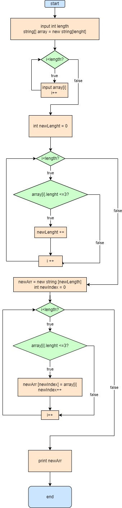
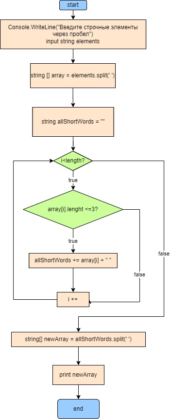

# Итоговая работа за I четверть
## Задача:
*Написать программу, которая из имеющегося массива строк сформирует массив из строк, длина которых меньше, либо равна 3 символам. Первоначальный массив можно ввести с клавиатуры, либо задать на старте выполнения алгоритма.
При решении не рекомендуется пользоваться коллекциями, лучше обойтись исключительно массивами.*

Перед нами стоит задача взять элементы из одного массива, удовлетворяющие неким условиям, и составить из них новый массив.

Наиболее очевидное решение:

1. Проходимся по циклу и считаем количество подходящих нам элеметов.
2. Создаём новый массив с размерностью, посчитанной в предыдущем пункте.
3. Проходимся по первоначальному массиву снова, но в этот раз элементы, удовлетворяющие условию, копируем в новый массив. Для определения индекса элемента в новом массиве используем счётчик.
4. Выводим получившийся массив на экран
5. Profit!

Можно уменьшить количество прохождений по массиву при помощи метода **split**

1. Создаём строчную переменную
2. Проходим по массиву, последовательно добавляя в строку все элементы, удовлетворяющие условию, и разделяя их пробелами.
3. Получившуюся строку делим при помощи **split**, используя пробел в качестве разделителя, и получаем новый массив строк, сразу нужной нам длины.

